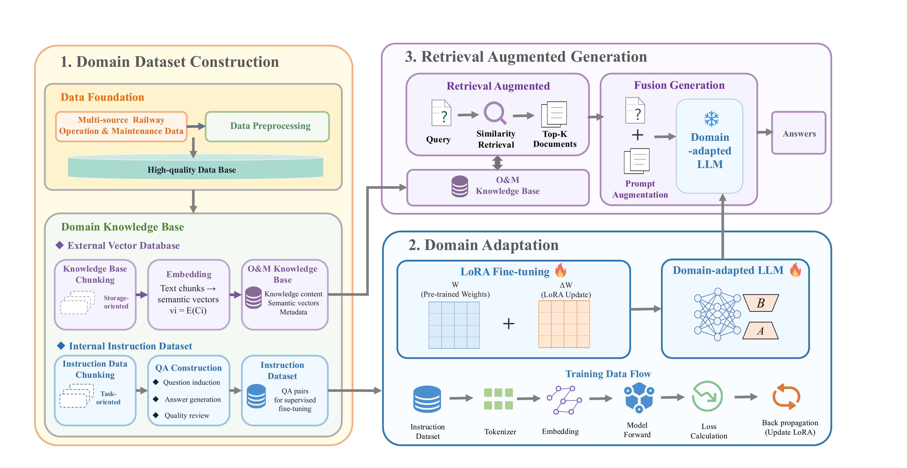
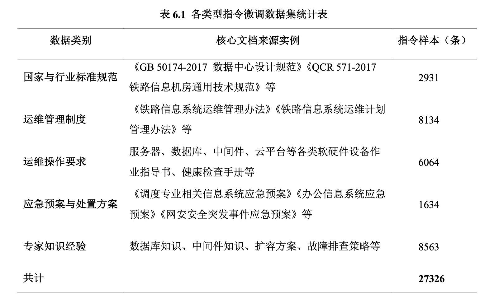

# RailOpsLLM

## A Domain-Adaptive Large Language Model for Railway Information System Operation and Maintenance via Fine-Tuning and Retrieval-Augmented Generation

<p align="center">
  
</p>

<p align="center"><em>Figure 1. Overview of the RailOpsLLM framework.</em></p>

Reproducibility code and metric-only artifacts for railway-domain question answering.

## Dataset composition

The railway O&M instruction dataset contains 27,326 instruction-response pairs
across five knowledge categories.

<p align="center">
  
</p>

<p align="center">
  <em>Table 1. Composition of the railway operation and maintenance instruction dataset.</em>
</p>

### Chinese version

<p align="center">
  
</p>

<p align="center">
  <em>Table 6.1. 各类型指令微调数据集统计表。</em>
</p>


The public repository does not distribute the source documents, raw instruction
data, private railway materials, or personally identifiable information. Only
aggregate dataset statistics are reported for reproducibility and privacy
protection.

## Scope and data policy

This repository contains fine-tuning, Dify RAG evaluation and direct-inference code. It deliberately does **not** distribute training data, test data, railway knowledge-base text, API keys, raw prompts, predictions, traces, runtime logs or base-model weights.

The final LoRA adapter is available from the GitHub Release. It must be loaded on `Qwen/Qwen2.5-7B-Instruct`.

## Layout

- `finetune/`: final LoRA training configuration and launcher.
- `rag/`: batch Dify RAG evaluation client.
- `base_inference/`: local and Bailian-compatible direct inference.
- `results/`: metric-only summaries and selected checkpoint metadata.
- `model/`: adapter metadata and release manifest.

## Environment

Create an environment from `environment.yml` or install `requirements.txt`. Activate an environment containing PyTorch, Unsloth, PEFT, Transformers and BERTScore before running scripts.

Set paths for private assets; none are included in this repository:

```bash
export MODEL_ROOT=/path/to/models
export TRAIN_DATASET_PATH=/path/to/traindata7236.json
export EVAL_DATASET_PATH=/path/to/testdata799.json
export BERTSCORE_MODEL=/path/to/local/bert-model
```

## Fine-tuning

```bash
bash finetune/run_train.sh finetune/train_config_final.py
```

The final configuration is LoRA r=64, alpha=64, dropout=0, learning rate 3e-4, warmup=50, epoch=2, effective batch size=2, sequence length=2048, linear scheduler and seed=42.

## Dify RAG evaluation

```bash
export DIFY_API_KEY='your-key'
export DIFY_BASE_URL='http://your-dify-host:port/v1'
export RAG_DATA_DIR=/path/to/private-data
export RAG_OUTPUT_DIR=outputs/rag
bash rag/run_batch_dify_rag_eval_unified.sh --test-file "$EVAL_DATASET_PATH" --run-name example
```

## Direct inference

For Bailian-compatible APIs:

```bash
export DASHSCOPE_API_KEY='your-key'
export EVAL_DATASET_PATH=/path/to/testdata799.json
python3 base_inference/run_bailian_infer.py --help
```

For local Qwen2.5 inference:

```bash
export MODEL_ROOT=/path/to/models
export EVAL_DATASET_PATH=/path/to/testdata799.json
bash base_inference/run_infer_qwen25_7b_eval.sh --fg
```

## Release integrity

Verify the release archive with its accompanying `.sha256` file. The final adapter was selected at checkpoint-7200 with segmented BERTScore F1 79.76306056835053.

## Data privacy and safety statement

This project focuses on large language models for railway information system
operation and maintenance. The dataset may involve railway operation,
maintenance, equipment, information-system, emergency-response, and expert
knowledge materials. Users must ensure that all data used with this project has
been lawfully obtained and is authorized for research, development, and
evaluation purposes.

The public repository does not distribute original railway documents, raw
instruction data, internal system records, operational logs, credentials,
network information, personal information, or other confidential materials.
Only desensitized code, aggregate dataset statistics, selected evaluation
results, and model-related metadata are released. Before using any data, users
should remove personal identifiers, account information, access credentials,
network addresses, equipment identifiers, proprietary technical details, and
other information that could create security or privacy risks.

This project is intended for research and evaluation only. Model outputs may
be incomplete, inaccurate, outdated, or misleading, and must not be treated as
authoritative instructions for railway operation, equipment maintenance,
dispatching, emergency response, cybersecurity, or other safety-critical
activities. Any output used in practice must be reviewed and verified by
qualified railway professionals against approved procedures and authoritative
source documents.

Users are responsible for protecting local data, controlling access to
datasets and model services, preventing unauthorized disclosure, and complying
with applicable laws, regulations, organizational policies, data-management
requirements, and information-security standards. The authors do not guarantee
that the model is suitable for a particular railway system or operational
scenario and are not responsible for losses or risks caused by unauthorized
data use, unverified model outputs, or improper deployment.

## Licence

No licence has yet been selected. Contact the repository owner before reusing this code or any derivative artifact.
